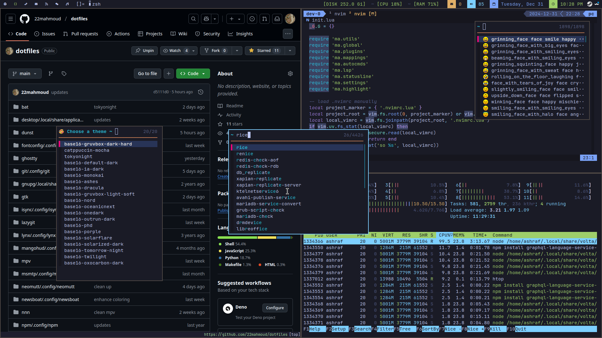

## Mahmoud Ashraf's Dotfiles 🎨

### Note

This repository contains some [encrypted files](https://github.com/22mahmoud/dotfiles/blob/main/.gitattributes) for private use, secured with
[age](https://github.com/FiloSottile/age). Ensure that you have `age` installed
and save the secret to the [pass](https://www.passwordstore.org/) store.
Additionally, update the recipient key in the Git [configuration file](https://github.com/22mahmoud/dotfiles/blob/main/git/.config/git/config#L8).

### How to install

1. Install [Gnu Stow](https://www.gnu.org/software/stow/)
1. Run `make`
1. Run `make rice` to install `tokyonight` theme as the default theme

### Software

- Terminal: [St](https://github.com/22mahmoud/st)
- WM: [Dwm](https://github.com/22mahmoud/dwm)
- Menu: [fzf-menu](https://github.com/22mahmoud/dotfiles/blob/main/scripts/.local/bin/fzf-menu)
- Shell: [zsh](https://www.zsh.org/)
- Font: [Nerd Fonts](https://www.nerdfonts.com/)
- Shell: [zsh](https://www.zsh.org/)
- Multiplexer: [tmux](https://github.com/tmux/tmux)
- Editor: [Neovim](https://github.com/22mahmoud/nvim)
- PDF viewer: [zathura](https://pwmt.org/projects/zathura/)
- Video Player: [mpv](https://mpv.io/)
- Syntax highlighting [bat](https://github.com/sharkdp/bat), [delta](https://github.com/dandavison/delta)
- ls: [eza](https://github.com/eza-community/eza)
- Email:
  - [neomutt](https://neomutt.org/)
  - [msmtp](https://marlam.de/msmtp/)
  - [mbsync](https://isync.sourceforge.io/mbsync.html)
  - [lynx](https://lynx.invisible-island.net/)
- Image Viewer: [nsxiv](https://github.com/22mahmoud/nsxiv)
- Browser: [qutebrowser](https://qutebrowser.org/)
- Notification: [dunst](https://dunst-project.org)
- RSS:
  - server: [miniflux](https://miniflux.app/)
  - client: [newsboat](https://newsboat.org/index.html)
- File Manager:
  - terminal: [nnn](https://github.com/jarun/nnn/)
  - GUI: [Thunar](https://docs.xfce.org/xfce/thunar/start)
- Gaming: [Steam](https://store.steampowered.com/), [Bottles (flatpak)](https://usebottles.com/), [Faugus](https://github.com/Faugus/faugus-launcher), [MangoHud](https://github.com/flightlessmango/MangoHud)
